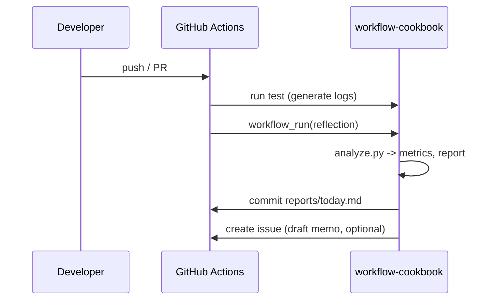

# 設計（Architecture）

## コンポーネント
- **Collector**: CI テストやツールから JSONL ログを収集
- **Analyzer**: `workflow-cookbook/scripts/analyze.py` がメトリクス算出と Why-Why 草案生成
- **Reporter**: `reports/today.md` と `reports/issue_suggestions.md` を生成
- **Proposer**: Issue/ドラフトPR を“提案のみ”で作成（自動改変なし）
- **Governance**: `governance/policy.yaml` に行動制約・SLO

## データモデル（概略）
- TestRecord: `{ name, status, duration_ms, ts? }`
- Metrics: `{ pass_rate, duration_p95, flaky_rate? }`
- Report: Markdown（メトリクスと Why-Why）

## シーケンス（Mermaid）

## サブディレクトリ対応方針
- `defaults.run.working-directory: workflow-cookbook`
- アーティファクトのパスは `workflow-cookbook/logs` に統一
